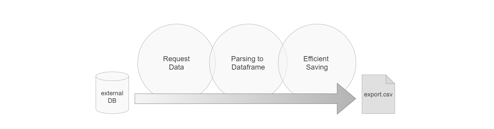
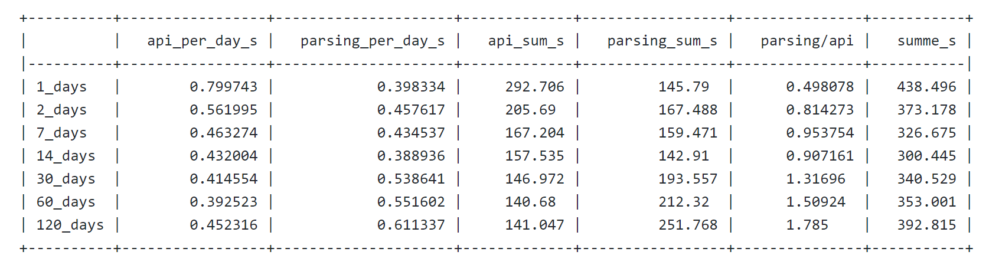
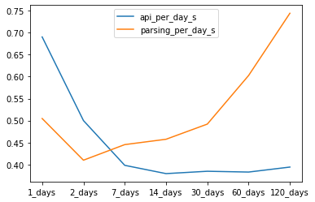
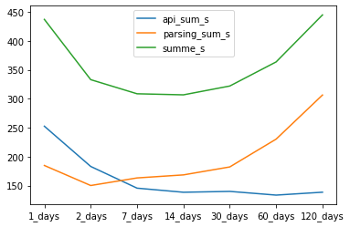
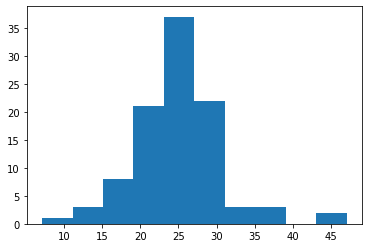
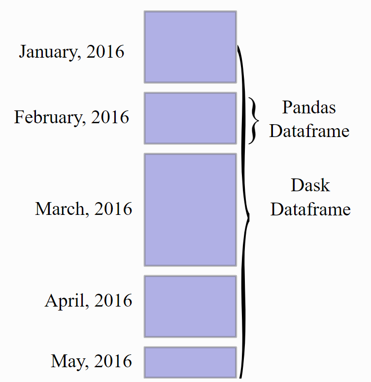
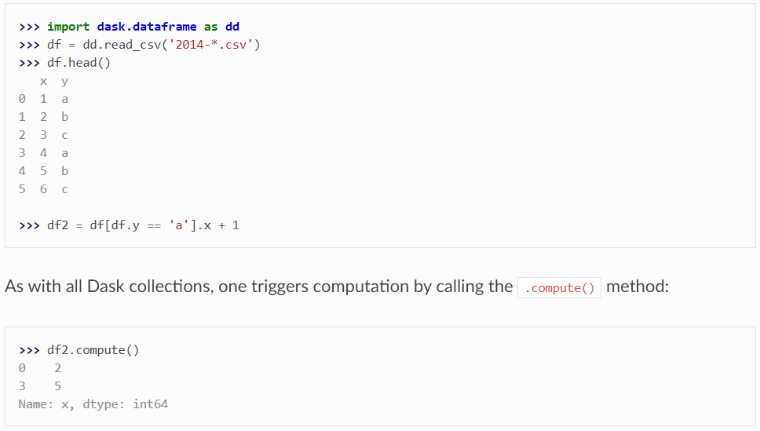
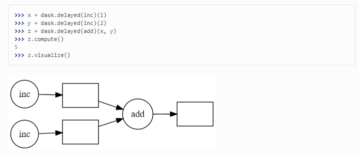

# Small Data
## How to speed up your application without the need for big data technologies?

The following work deals with performance issues in an existing program for data extraction from an API for timeseries measurement values. The baseline code was growing over time and has therefore never been rethought to improve it from a basis. In addition, no performance analysis has ever been conducted for it.

The work is showing how and how much I could improve...

*...the performance of data retrieval via REST API*

*...parsing of JSON encoded timeseries data*

*...and saving it into a .csv file?*



### Initial Thoughts and Plan
- Analysis of the state of the Art - which part takes how much time?
- Improve performance of REST API request by varying request time horizons
- Improve parsing of json files
- Improve overall Performance by using Multithreading

#### For those thinking... I am already bored, so why should I read this?
I tried capture only the most important parts of the code samples and not to repeat anything. Therefore the code examples will not work as they are in this article. Find the corresponding jupyter notebook in the Github repository. However, this is still not the most astonishing story to read. To make it easier: you can scan through it and find the most important points in **bold**. Or you go directly down to the summary to get the key findings.

## Benchmark
In order to have a **baseline for comparison**, at first the existing functions used are shown. This includes:
- function for the api request (datapi_channels_fields) (*not shown here*)
- function for parsing (parse_json)
- main function (baseline)

The script is based on an older version starting from a time with no python knowledge at all, and and was evolving over time. For example, is was taken as a given fact that only two days at once can be retrieved from the API, based on an older version of this API. However, this restriction changed and also longer time horizons can be retrieved at once now. The 'baseline' function is already adapted in a way so that it supports later used varying time horizons (days to request at once).

The **benchmark time** for this initial version can be found in the **later chapter 1.2.1**.

```python
def parse_json(j):
    data_twodays = pd.DataFrame()
    for a in j['Records']:
        if a['Value'] is not None:
            rec_key = str(a['ChannelType'] + '_' + str(a['NodeType']) + str(' [') + str(a['Value']['Unit']) + str(']'))
            rec_value = a['Value']['Value']
            rec_logdt_dt = datetime.datetime.strptime(a['LogDt'], '%Y-%m-%dT%H:%M:%SZ')
            rec_logdt_UTC = rec_logdt_dt.replace(tzinfo=tz.tzutc())
            data_twodays.at[rec_logdt_UTC, rec_key] = rec_value

    return data_twodays
```

```python
def baseline(days):
    # init arrays for request timestamp
    timespan=int(np.ceil((until_day + datetime.timedelta(days=1) - start_day).days/days))
    period=datetime.timedelta(days = days, hours=0, minutes=0)
    startdate_list=[]
    for x in range(0, (timespan)):
        startdate_list.append([datetime.datetime.combine(start_day, datetime.time(0, 0)) + period*x][0])
        
    # predefine dataframe
    df_all = pd.DataFrame()
    # loop over list with startdates
    for requ_start in startdate_list:
        requ_end = requ_start + period - datetime.timedelta(minutes=1)
        delta = (requ_end + datetime.timedelta(minutes=1) -requ_start).days
        # get data from api
        j = datapi_channels_fields(requ_start, requ_end, channels, pvsystemid)

        # get tz
        olson_tz = tz.gettz(j['Olson'])
        
        # parse json to data frame & add timezone info (UTC)
        data_twodays = parse_json(j)

        # add to overall data frame
        df_all = pd.concat([df_all, data_twodays], sort=True)

    return df_all
```

## Performance improvements

In order to improve the performance of this application, at first it has to be found out **which part takes longest** and a benchmark has to be set. Therefore, the Python **"timeit"** module is used to track the durations of the request itself as well as the parsing. This task is combined with the first analysis of possible improvements:

### Improve Performance of REST API request by varying request time horizons

Firstly, the **time horizon for the request is varied** - so that not only just two days at once are retrieved from the API, but also longer time horizons. Therefore, the initial baseline function is adapted to enable this time horizons instead of a hard coded two days interval. **The 2_days result is the benchmark time for the analysis**. The code below defines a list with the time horizons used for comparison.

```python
# define a list of varying time horizons for the request
days_list = [1, 2, 7, 14, 30, 60, 120]
days_names = [str(d) + '_days' for d in days_list]
days_names
```
    ['1_days', '2_days', '7_days', '14_days', '30_days', '60_days', '120_days']

The table below shows the difference of the time needed for the **API request** as well as for **parsing**, for **varying time horizons from 1 day to 120 days** within one request:
- *api_per_day_s* are the seconds needed to get the data from the api for one day (mean)
- *parsing_per_day_s* are the seconds needed to parse the data for one day (mean)
- *api_sum_s* is the overall time taken by the api request (sum)
- *parsing_sum_s* is the overall time taken for parsing (sum)
- *parsing/api* is the ratio between parsing and the api duration sums
- *summe_s* is the overall sum to get the data back as a data frame



seconds per day of data | seconds for the overall request
- | - 
 | 

TODO: UPDATE plots and explanation! 
The diagrams above show a request of **60 days** as the best option. (Altough there is not a really clear trend). The time needed for a request is increasing again for 120 days.

###  Improve parsing of json files

The JSON string retrieved from the API is **nested** and therefore not easy to parse to a tabular format as needed in the exports. Here is an example:

``` markdown
{
  "Records": [
    {
      "ChannelType": "UACMeanL1",
      "Value": {
        "Value": 0,
        "Unit": "Voltage_100mV"
      },
      "Validity": "Calculated",
      "TargetDuration": "00:05:00",
      "Duration": "00:04:59",
      "TemplateId": null,
      "DataSourceIdentity": {
        "DataSourceId": "240.198074",
        "DataSourceType": "Datamanager"
      },
      "LastModifiedDt": "2019-06-01T04:01:07.9053",
      "LogDt": "2019-05-31T22:00:00Z",
      "NodeType": 97,
      "DeviceType": 123,
      "Idx": 28,
      "ComponentId": null,
      "DeviceId": "2142085f-a929-4e29-adbc-aa4b00acd810"
    },
  ],
  "Olson": "Europe/Berlin",
  "Error": null
}
```

It contains the "Records" with all the required data, and the **timezone** ("Olson"). The timezone is needed to convert the data to local time from UTC. One **ChannelType** should be one column, the **LogDt** should be the datetime index. There is also a **NodeType** which enumerates the number of the inverter in the PvSystem. If there are multiple inverters in the system, the UACMeanL1 channel exists multiple times, once for each inverter and therefore there must be a column in the dataframe depending on the ChannelType AND NodeType combination. Also the **Unit** is an important information to be added to the export file. The image below shows a sample how the data and headers should look like after parsing:

//TODO image of data frame with data!

The **procedure of the initial solution** works as follows:
1. data of two days is requested
2. JSON is given to the parsing function
3. the time interval (can be 5, 15 or 30 minutes) is read from the first entries
4. an empty dataframe for the two days data is initiated
5. a *for* loop iterates over each "Records" entry in the JSON string:
    - it defines a columns key with the ChannelType, NodeType and Unit of the record
    - it uses the LogDt as the index for the record
    - it adds utc timezone info to every LogDt
    - it uses the pandas.at method to save the value at the corresponding column and index
6. the dataframe is returned to the main function and there concatenated to the dataframe containing all the values (attaching two more days of data in each loop)
7. At the end, missing timestamps are filled with NaN values and the timezone is changed to local time for the overall dataframe.

As an **improvement strategy**, a performance comparison is made by replacing the use of the **pandas "at"** function. Instead, the data is being **parsed in a dictionary** and transformed to a dataframe in the end. For the experiment, a locally saved JSON file with only two days of data is read in. The data is equal to the data requested via the API. The test file can be found in the Git repository for reproducability.


```python
# new function to parse the json string with dict
def parse_json_new(j):
    data_twodays = {}
    for a in j['Records']:
        if a['Value'] is not None:
            try:
                rec_key = str(a['ChannelType'] + '_' + str(a['NodeType']) + str(' [') + str(a['Value']['Unit']) + ']')            
                data_twodays[rec_key].update(
                    {str(datetime.datetime.strptime(a['LogDt'], "%Y-%m-%dT%H:%M:%SZ")): a['Value']['Value'],                    }
                    )
            except KeyError:
                data_twodays[rec_key] = {}
            
    data_twodays = pd.DataFrame(data_twodays)
    return data_twodays
```

Following code is used to compare the time needed by the parsing functions:

```python
with open ('test_json_2d.txt') as f:
    j = json.load(f)

faster = []
for x in range(0,100):
    starttime_parsing = timeit.default_timer()
    df, interval = parse_json_new(j)
    parse_json_new_time = timeit.default_timer() - starttime_parsing

    starttime_parsing = timeit.default_timer()
    df_base, interval = parse_json(j)
    parse_json_base = timeit.default_timer() - starttime_parsing

    faster.append(parse_json_base/parse_json_new_time)
    
print(f'{np.mean(faster)} times faster!!')
```

    25.576689731084194 times faster!!
    
*TODO: UPDATE histogram plot and check numbers below*


The code above repeated the parsing procedure 100 times since the performance is varying heavily in each iteration. **It parses in each iteration once with the baseline parsing function and once with the new one.** Then, it adds the **time ratio between the new and the old function** to a list. The outcome is printed below the code block and also shown in the histogram plot above: the new version is around **25 times faster in parsing** compared to the old one.
Looking back at the table from the varying time horizons, this means an improvement from ~200 down to 8 seconds for parsing! **//TODO: update this time!!**

### Improve overall Performance by using Parallel Computation

An additional improvement in performance is expected if the **process can be parallelized**. Therefore, parallelization based on a [Medium article](https://medium.com/@mjschillawski/quick-and-easy-parallelization-in-python-32cb9027e490) is tested, using the **Parallel package**.

The block below uses the multiprocessing package to show the number of cores available on the hardware.

```python
import multiprocessing
from joblib import Parallel, delayed
from tqdm import tqdm

num_cores = multiprocessing.cpu_count()
print(f'{num_cores} Cores available!')
```

    4 Cores available!
    
    
In the code example below the syntax for a parallel for loop is shown. *inputs* defines the list over which should be iterated within the for loop, like a list or a pandas series. *my_function* defines the function that should be used and *processed_list* holds the result.

```python
processed_list = Parallel(n_jobs=num_cores)(delayed(my_function(i,parameters) for i in inputs)
```

The functionalilty is explained in the artice as follows:
 
> "*delayed(my_function(i,parameters) for i in inputs) behind the scenes creates tuple of the function, i, and the parameters, one for each iteration. Delayed creates these tuples, then Parallel will pass these to the interpreter.
> Parallel(n_jobs=num_cores) does the heavy lifting of multiprocessing. Parallel forks the Python interpreter into a number of processes equal to the number of jobs (and by extension, the number of cores available). Each process will run one iteration, and return the result.*"

In the actual example, it is considered the best solution to parallelize a whole iteration, including the api request and parsing. So, **one parallelized computation includes the computions for one startdate** in the list of startdates. This means that *startdate_list* is the *inputs* for the code sample above.

As a next step, the parallelization is implemented for the existing code. The for loop over the startdates in the baseline function is drawn out to make an own function out of it, because this is the part that should be parallelized. Therefore, we have two functions now instead of one:
- The *parallelized* function includes the computation for one start date
- in the *baseline_new_parse* function there are the computations that are conducted for the overall dataframe or in preparation for the request, such as definining the list with start dates or the transfer to the local timezone.

```python
def parallelized(requ_start, period):
    # predefine dataframe
    df_all = pd.DataFrame()

    requ_end = requ_start + period - datetime.timedelta(minutes=1)
    delta = (requ_end + datetime.timedelta(minutes=1) -requ_start).days
    
    # get data from api
    j = datapi_channels_fields(requ_start, requ_end, channels, pvsystemid)

    # get tz
    olson_tz = tz.gettz(j['Olson'])

    # parse json to data frame & add timezone info (UTC)
    data_twodays, interval = parse_json_new(j)

    # add to overall data frame
    df_all = pd.concat([df_all, data_twodays], sort=True)
    
    return df_all
```


```python
def baseline_new_parse_parallel(days):
    # init arrays for request timestamp
    timespan=int(np.ceil((until_day + datetime.timedelta(days=1) - start_day).days/days))
    period=datetime.timedelta(days = days, hours=0, minutes=0)
    startdate_list=[]
    for x in range(0, (timespan)):
        startdate_list.append([datetime.datetime.combine(start_day, datetime.time(0, 0)) + period*x][0])

    df_par = Parallel(n_jobs=num_cores)(delayed(parallelized)(i,period) for i in tqdm(startdate_list))
        
    df_all = pd.concat(df_par)
    
    olson_tz = 'Europe/Berlin'
    # convert to local time
    df_all = df_all.tz_convert(olson_tz)
    
    return df_all
```
The result from the parallel computation is a dataframe with multiple entries, one for each startdate request. That is why *pd.concat* is used to have the data in one single dataframe. //TODO: is that right?

```python
df_timer = pd.DataFrame(index = ['60_days'], columns = ['summe_func_s'])

starttime = timeit.default_timer()
df_all, soa_api_requ, soa_parsing , soa_api_requ_days, soa_parsing_days = baseline_new_parse_parallel(60)
summe = timeit.default_timer() - starttime

df_timer.loc['60_days'] = [summe]

print(tabulate(df_timer, headers='keys', tablefmt='psql'))
```


    +---------+----------------+
    |         |   summe_func_s |
    |---------+----------------|
    | 60_days |        72.0806 |
    +---------+----------------+
    
    
// TODO_UPDATE
So the code had to be adapted a little bit to enable the parallel computation. However, the changes where rather small and it can be seen that the time needed for the overall procedure could be **decreased to a half**! 

### Using Dask
Another possibility to make use of parallel computation is using the **Dask Package**. It works together with familiar python packages such as numpy, pandas, or scikit learn and is therefore very easy to use. An **example how dask can be use with pandas** can be seen in the [documentation](https://docs.dask.org/en/latest/dataframe.html) and is summarized as follows:

> **Design**
> Dask DataFrames coordinate many Pandas DataFrames/Series arranged along the index. A Dask DataFrame is partitioned row-wise, grouping rows by index value for efficiency. These Pandas objects may live on disk or on other machines.



> **Dask DataFrame copies the Pandas API**
> Because the dask.dataframe application programming interface (API) is a subset of the Pandas API, it should be familiar to Pandas users. There are some slight alterations due to the parallel nature of Dask:



For the actual example, instead of using the dask API to the dataframe, we use the **delayed function**, since we want to parallelize a whole for loop with multiple steps. There is again a very straightforward explanation in the [documentation](https://docs.dask.org/en/latest/delayed.html) for this use case:

> Sometimes problems don’t fit into one of the collections like dask.array or dask.dataframe. In these cases, users can parallelize custom algorithms using the simpler dask.delayed interface. This allows one to create graphs directly with a light annotation of normal python code:



The syntax is very similar to the parallel package and can be implemented as shown in the snippet below:

```python
    results = []
    for i in tqdm(startdate_list):
        y = dask.delayed(parallelized)(i,period)
        results.append(y)

    results = dask.compute(*results)
    
    df_all = pd.concat(results)
```

Computation time for the whole request and parsing process:

```
    +---------+----------------+
    |         |   summe_func_s |
    |---------+----------------|
    | 60_days |        78.2897 |
    +---------+----------------+
```
    
The **result is similar to the one from the Parallel package**, but some seconds slower. So for this strategy for making use of parallel computation both packages are **very useful and almost equally fast**. For other use cases where directly a pandas dataframe computation should be speeded up, dask seems very easy to use. We will try this when saving the data to a .csv file.

### Saving to .csv
Here follows a short chapter on saving the dataframe to a .csv file on the disk.

**Benchmark**
The benchmark used the standard *pd.to_csv* function to save the file. The computation time is shown below.

```python
# save file
print("saving...")
starttime = timeit.default_timer()
df_all.to_csv(filename, sep=';', decimal=',')
soa_saving = timeit.default_timer() - starttime
print("DONE")
print(soa_saving)
```

    
**Using Dask**
We want to check if we can speed the process up by using the Dask API for pandas dataframe:


## Summary and Conclusion
This analysis showed that there are multiple possibilities how to make python computations faster. Here are the key findings of this analysis and how much time could be saved with which approach:
- In the baseline scenarion, the overall process took XX seconds (//TODO: 2_days plus saving!!)
- The adapted time horizon in the API request could save XX seconds
- The parsing was the biggest drawback of the old code version. Using a dictionary for parsing instead of the pandas *at* function saved XX seconds
- The parallelization speeded up the process XX seconds more, therewith the computaion time was reduced by half
- The parallel saving with dask instead the pandas dataframe saved XX more seconds

It was shown that the "grown" code which is adapted again and again over time needs some facelift every now and then, the tools above can help :)

### so... boost yourself to boost your code!
When starting a new project one always has to weigh on if there should be an implementation available as fast as possible, or if the implementation should be long lasting and reusable also in future. Therefore, I suggest to spend at least some thoughts on what is the overall goal and if it would be better to spend more time in planning and specifications instead of just starting to code.

However, this is the process of learning and self improvement, and no perfect result can exist without having had some iterations and making failures. Therefore I want to finish this artice with a quotation (in german):
> "*Und doch, ist nicht dies das Leben -? ich glaube: daß aus so viel dürftigen, bangen, kleinlichen und schmählichen Einzelheiten sich am Ende doch ein großartiges Ganzes zusammensetzt, das ja nicht wäre, wenn wirs verstünden und leisteten, sondern an dem wir mit unserem Können und unserem Mißlingen gleich weit beteiligt sind.*"
> *-- Rainer Maria Rilke --*


