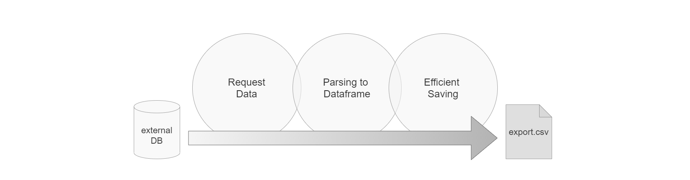

# Small Data
## How to speed up your application without the need for big data technologies?

The following work deals with performance issues in an existing program for data extraction from an API for timeseries measurement values. The baseline code was growing over time and has therefore never been rethought to improve it from a basis. In addition, no performance analysis has ever been conducted for it.

The work is showing how and how much I could improve...

*...the performance of data retrieval via REST API*

*...parsing of JSON encoded timeseries data*

*...and saving it into a .csv file?*



### Initial Thoughts and Plan
- Analysis of the state of the Art - which part takes how much time?
- Improve performance of REST API request by varying request time horizons
- Improve parsing of json files
- Improve overall Performance by using Multithreading

#### For those thinking... I am already bored, so why should I read this?
I tried capture only the most important parts of the code samples and not to repeat anything. Therefore the code examples will not work as they are in this article. Find the corresponding jupyter notebook in the Github repository. However, this is still not the most astonishing story to read. To make it easier: you can scan through it and find the most important points in **bold**. Or you go directly down to the summary to get the key findings.

## Benchmark
In order to have a **baseline for comparison**, at first the existing functions used are shown. This includes:
- function for the api request (datapi_channels_fields) (*not shown here*)
- function for parsing (parse_json)
- main function (baseline)

The script is based on an older version starting from a time with no python knowledge at all, and and was evolving over time. For example, is was taken as a given fact that only two days at once can be retrieved from the API, based on an older version of this API. However, this restriction changed and also longer time horizons can be retrieved at once now. The 'baseline' function is already adapted in a way so that it supports later used varying time horizons (days to request at once).

The **benchmark time** for this initial version can be found in the later chapter 1.2.1.

```python
def parse_json(j):
    data_twodays = pd.DataFrame()
    for a in j['Records']:
        if a['Value'] is not None:
            rec_key = str(a['ChannelType'] + '_' + str(a['NodeType']) + str(' [') + str(a['Value']['Unit']) + str(']'))
            rec_value = a['Value']['Value']
            rec_logdt_dt = datetime.datetime.strptime(a['LogDt'], '%Y-%m-%dT%H:%M:%SZ')
            rec_logdt_UTC = rec_logdt_dt.replace(tzinfo=tz.tzutc())
            data_twodays.at[rec_logdt_UTC, rec_key] = rec_value

    return data_twodays
```

```python
def baseline(days):
    # loop over list with startdates
    for requ_start in startdate_list:
        requ_end = requ_start + period - datetime.timedelta(minutes=1)
        delta = (requ_end + datetime.timedelta(minutes=1) -requ_start).days
        # get data from api
        j = datapi_channels_fields(requ_start, requ_end, channels, pvsystemid)

        # get tz
        olson_tz = tz.gettz(j['Olson'])
        
        # parse json to data frame & add timezone info (UTC)
        data_twodays = parse_json(j)

        # add to overall data frame
        df_all = pd.concat([df_all, data_twodays], sort=True)

    return df_all
```

## Performance improvements

In order to improve the performance of this application, at first it has to be found out **which part takes longest** and a benchmark has to be set. Therefore, the Python **"timeit"** module is used to track the durations of the request itself as well as the parsing. This task is combined with the first analysis of possible improvements:

### Improve Performance of REST API request by varying request time horizons

Firstly, the **time horizon for the request is varied** - so that not only just two days at once are retrieved from the API, but also longer time horizons. Therefore, the initial baseline function is adapted to enable this time horizons instead of a hard coded two days interval. **The 2_days result is the benchmark for the analysis**.

```python
# define a list of varying time horizons for the request
days_list = [1, 2, 7, 14, 30, 60, 120]
days_names = [str(d) + '_days' for d in days_list]
days_names
```
    ['1_days', '2_days', '7_days', '14_days', '30_days', '60_days', '120_days']

The table below shows the difference of the time needed for the **API request** as well as for **parsing**, for **varying time horizons from 1 day to 120 days** within one request:
- *api_per_day_s* are the seconds needed to get the data from the api for one day (mean)
- *parsing_per_day_s* are the seconds needed to parse the data for one day (mean)
- *api_sum_s* is the overall time taken by the api request (sum)
- *parsing_sum_s* is the overall time taken for parsing (sum)
- *parsing/api* is the ratio between parsing and the api duration sums
- *summe_s* is the overall sum to get the data back as a data frame


A | B
- | - 
 | 

TODO: UPDATE plots and explanation! 
The diagrams above show a request of **60 days** as the best option. (Altough there is not a really clear trend). The time needed for a request is increasing again for 120 days.

###  Improve parsing of json files

The JSON string retrieved from the API is **nested** and therefore not easy to parse to a tabular format as needed in the exports. Here is an example:

``` markdown
{
  "Records": [
    {
      "ChannelType": "UACMeanL1",
      "Value": {
        "Value": 0,
        "Unit": "Voltage_100mV"
      },
      "Validity": "Calculated",
      "TargetDuration": "00:05:00",
      "Duration": "00:04:59",
      "TemplateId": null,
      "DataSourceIdentity": {
        "DataSourceId": "240.198074",
        "DataSourceType": "Datamanager"
      },
      "LastModifiedDt": "2019-06-01T04:01:07.9053",
      "LogDt": "2019-05-31T22:00:00Z",
      "NodeType": 97,
      "DeviceType": 123,
      "Idx": 28,
      "ComponentId": null,
      "DeviceId": "2142085f-a929-4e29-adbc-aa4b00acd810"
    },
  ],
  "Olson": "Europe/Berlin",
  "Error": null
}
```

It contains the "Records" with all the required data, and the **timezone** ("Olson"). The timezone is needed to convert the data to local time from UTC. One **ChannelType** should be one column, the **LogDt** should be the datetime index. There is also a **NodeType** which enumerates the number of the inverter in the PvSystem. If there are multiple inverters in the system, the UACMeanL1 channel exists multiple times, once for each inverter and therefore there must be a column in the dataframe depending on the ChannelType AND NodeType combination. Also the **Unit** is an important information to be added to the export file.

The **procedure of the initial solution** works as follows:
1. data of two days is requested
2. JSON is given to the parsing function
3. the time interval (can be 5, 15 or 30 minutes) is read from the first entries
4. an empty dataframe for the two days data is initiated
5. a *for* loop iterates over each "Records" entry in the JSON string:
    - it defines a columns key with the ChannelType, NodeType and Unit of the record
    - it uses the LogDt as the index for the record
    - it adds utc timezone info to every LogDt
    - it uses the pandas.at method to save the value at the corresponding column and index
6. the dataframe is returned to the main function and there concatenated to the dataframe containing all the values (attaching two more days of data in each loop)
7. At the end, missing timestamps are filled with NaN values and the timezone is changed to local time for the overall dataframe.

As an **improvement strategy**, a performance comparison is made by replacing the use of the **pandas "at"** function. Instead, the data is being **parsed in a dictionary** and transformed to a dataframe in the end. For the experiment, a locally saved JSON file with only two days of data is read in. The data is equal to the data requested via the API. The test file can be found in the Git repository for reproducability.


```python
# new function to parse the json string with dict
def parse_json_new(j):
    data_twodays = {}
    for a in j['Records']:
        if a['Value'] is not None:
            try:
                rec_key = str(a['ChannelType'] + '_' + str(a['NodeType']) + str(' [') + str(a['Value']['Unit']) + ']')            
                data_twodays[rec_key].update(
                    {str(datetime.datetime.strptime(a['LogDt'], "%Y-%m-%dT%H:%M:%SZ")): a['Value']['Value'],                    }
                    )
            except KeyError:
                data_twodays[rec_key] = {}
            
    data_twodays = pd.DataFrame(data_twodays)
    return data_twodays
```

Following code is used to compare the time needed by the parsing functions:

```python
with open ('test_json_2d.txt') as f:
    j = json.load(f)

faster = []
for x in range(0,100):
    starttime_parsing = timeit.default_timer()
    df, interval = parse_json_new(j)
    parse_json_new_time = timeit.default_timer() - starttime_parsing

    starttime_parsing = timeit.default_timer()
    df_base, interval = parse_json(j)
    parse_json_base = timeit.default_timer() - starttime_parsing

    faster.append(parse_json_base/parse_json_new_time)
    
print(f'{np.mean(faster)} times faster!!')
```

    25.576689731084194 times faster!!
    
*TODO: UPDATE histogram plot and check numbers below*


The code above repeated the parsing procedure 100 times since the performance is varying heavily in each iteration. **It parses in each iteration once with the baseline parsing function and once with the new one.** Then, it adds the **time ratio between the new and the old function** to a list. The outcome is printed and also shown in the histogram plot shown above: the new version is around **25 times faster in parsing** compared to the old one.
Looking back at the table from the varying time horizons, this means an improvement from ~200 down to 8 seconds for parsing! **TODO: update this time!!**

### Improve overall Performance by using Parallel Computation

An additional improvement in performance is expected if the process can be parallelized. Therefore, parallelization based on a Medium article (https://medium.com/@mjschillawski/quick-and-easy-parallelization-in-python-32cb9027e490) is tested. 

The block below uses the multiprocessing package to get the number of cores available on the hardware.

```python
import multiprocessing
from joblib import Parallel, delayed
from tqdm import tqdm

num_cores = multiprocessing.cpu_count()
print(f'{num_cores} Cores available!')
```

### Using Dask

### Saving to .csv

## Summary and Conclusion
### General
### Boost yourself to boost your code


# delete

You can use the [editor on GitHub](https://github.com/diewaldnicole/dsia_big_data/edit/gh-pages/index.md) to maintain and preview the content for your website in Markdown files.

Whenever you commit to this repository, GitHub Pages will run [Jekyll](https://jekyllrb.com/) to rebuild the pages in your site, from the content in your Markdown files.

### Markdown

Markdown is a lightweight and easy-to-use syntax for styling your writing. It includes conventions for

```markdown
Syntax highlighted code block

# Header 1
## Header 2
### Header 3

- Bulleted
- List

1. Numbered
2. List

**Bold** and _Italic_ and `Code` text

[Link](url) and 
```

For more details see [GitHub Flavored Markdown](https://guides.github.com/features/mastering-markdown/).

### Jekyll Themes

Your Pages site will use the layout and styles from the Jekyll theme you have selected in your [repository settings](https://github.com/diewaldnicole/dsia_big_data/settings). The name of this theme is saved in the Jekyll `_config.yml` configuration file.

### Support or Contact

Having trouble with Pages? Check out our [documentation](https://docs.github.com/categories/github-pages-basics/) or [contact support](https://github.com/contact) and we’ll help you sort it out.
